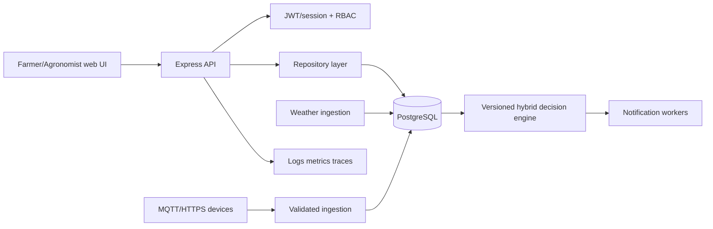

# Target Architecture

The Express application is now the compatibility layer over a PostgreSQL repository boundary. JSON remains available only as a migration fixture and is not used by runtime routes.

The existing formula engine is the baseline. Machine learning is an optional, versioned signal and cannot replace agronomic safety rules without validated field data and agronomist approval.

## Migration Boundary

Routes should continue to expose the current `/api` contracts while `db.js` is replaced by repositories. The migration must include a controlled import, foreign-key validation, row-count checks, rollback procedure, and dual-read comparison before the JSON adapter is removed.