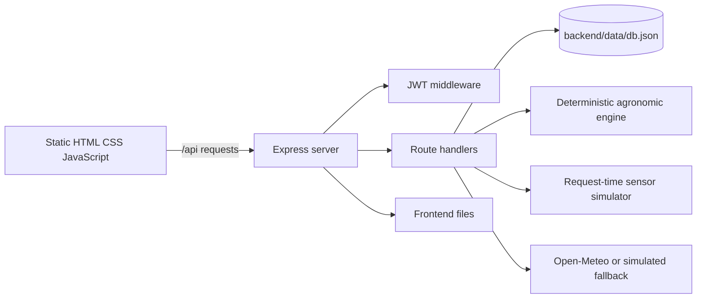
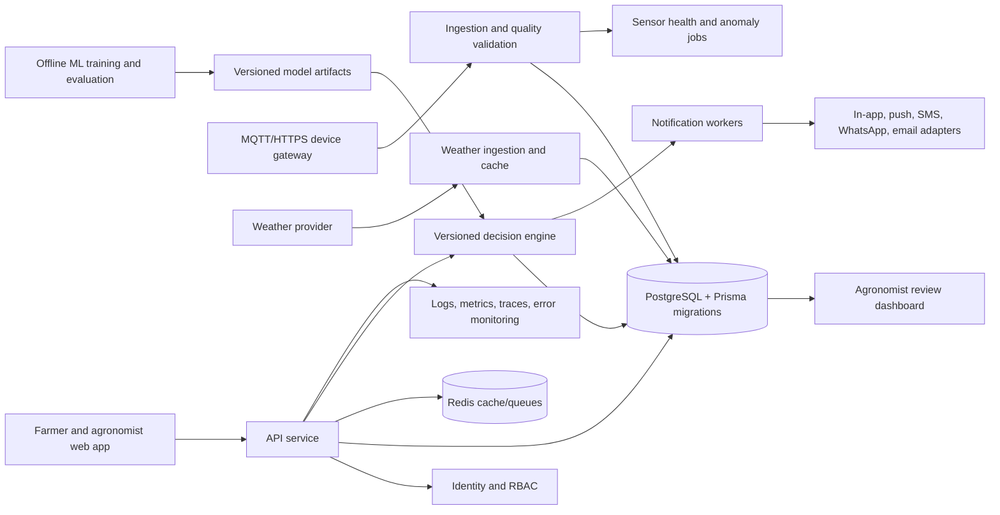

# KhetAI Architecture Audit

Date: 2026-09-20

## Executive Summary

KhetAI is a functional sugarcane irrigation demonstration with a clear browser-to-API flow, basic JWT authentication, plot ownership checks, transparent agronomic formulas, simulated sensor readings, and a weather-provider fallback. It is not production-ready yet.

The highest-risk issues are the JSON-file database, missing request validation, long-lived browser-stored bearer tokens, unsafe frontend HTML interpolation, uncached external weather calls, incomplete asynchronous error handling, and the absence of automated tests and operational telemetry. The advisory and yield features are deterministic rules and heuristics; they must not be described as trained machine-learning models until real labeled data and evaluation exist.

## Current Architecture

### Frontend

- `frontend/index.html` is the public landing page.
- `frontend/login.html` and `frontend/signup.html` handle authentication.
- `frontend/dashboard.html` contains the authenticated single-document dashboard and its views.
- `frontend/js/api.js` wraps API calls, stores the JWT and user profile in `localStorage`, and redirects on `401` responses.
- `frontend/js/dashboard.js` manages client state, navigation, data loading, charts, forms, preferences, and rendering.
- Chart.js and Leaflet are loaded from CDNs.

### Backend

- `backend/server.js` creates the Express application, enables unrestricted CORS, mounts all routes, serves the frontend locally, and exposes `/api/health`.
- `backend/routes/` contains authentication, plot, dashboard, advisory, weather, sensor, fertigation, yield, and alert endpoints.
- `backend/middleware/auth.js` verifies Bearer JWTs.
- `backend/db.js` provides synchronous whole-file JSON CRUD helpers.
- `backend/utils/aiEngine.js` calculates irrigation, fertigation, and yield heuristics.
- `backend/utils/sensorSim.js` generates readings and history.
- `backend/utils/weather.js` calls Open-Meteo and falls back to deterministic simulated weather.
- `backend/utils/multilingual.js` generates advisory messages in English, Hindi, Kannada, and Marathi.

### Main Request Flow

1. A farmer registers or logs in and receives a JWT.
2. The browser stores the token and sends it as a Bearer token on protected requests.
3. A plot is selected or created.
4. Advisory requests obtain or create a current simulated reading, fetch weather, and run the deterministic engine.
5. The dashboard separately requests summaries, advisory data, sensors, yield, weather, fertigation, and alerts.
6. Irrigation events are written to the JSON file and influence future simulated readings.

## Existing API Surface

| Area | Endpoints | Current behavior |
|---|---|---|
| Health | `GET /api/health` | Basic liveness response |
| Auth | `POST /api/auth/register`, `POST /api/auth/login`, `GET /api/auth/me` | bcrypt password hashing and JWT bearer authentication |
| Plots | `GET/POST /api/plots`, `GET/PUT/DELETE /api/plots/:id` | User-scoped plot CRUD and generated history |
| Dashboard | `GET /api/dashboard/summary` | Recomputes advisory data for every owned plot |
| Advisory | `GET /api/advisory/:plotId`, `POST .../log`, `GET .../history` | Formula-based recommendation and irrigation logging |
| Weather | `GET /api/weather/:plotId` | Five-day live or simulated forecast |
| Sensors | `GET /api/sensors/:plotId` | Latest simulated reading and 14-day history |
| Fertigation | `GET /api/fertigation/:plotId` | Stage-based generic fertilizer guidance |
| Yield | `GET /api/yield/:plotId` | Heuristic yield range based on simulated stress |
| Alerts | `GET /api/alerts`, `POST /api/alerts/:alertId/read` | Request-time generated alerts and read markers |

## Security Findings

### High priority

1. **Bearer tokens are stored in `localStorage`.** Any successful XSS can read the token. Use short-lived access tokens with rotating refresh tokens in secure, HttpOnly, SameSite cookies where the deployment model allows it.
2. **Frontend interpolation uses `innerHTML` for user-controlled values.** Plot names, crop values, and alert content can become stored XSS. Use text nodes, DOM APIs, or a trusted escaping helper and add XSS regression tests.
3. **Request validation is incomplete.** Registration, plots, updates, coordinates, dates, irrigation logs, and query parameters accept malformed or out-of-range values. Add centralized schemas and field allowlists.
4. **No rate limiting or abuse controls exist.** Login and registration are brute-forceable. Add endpoint-specific rate limits, account protection, and audit events.
5. **CORS is unrestricted.** Restrict origins by environment and reject unsafe production configuration.
6. **JWT configuration is not validated at startup.** Require a strong secret and fail fast when it is absent or too weak.

### Additional security gaps

- No roles or permissions beyond ownership checks.
- No refresh-token revocation, password reset, contact verification, or session management.
- No security headers or Content Security Policy.
- CDN scripts have no Subresource Integrity configuration.
- No request IDs, audit log, centralized error policy, or security event monitoring.
- The current alert read endpoint does not verify that the supplied ID is a currently generated alert for one of the user's plots.

## Data and Scalability Findings

`backend/db.js` synchronously reads and rewrites the entire database for every operation. It has no transactions, locking, indexes, migrations, backup strategy, or multi-instance consistency. A crash during plot deletion can leave related collections inconsistent. Render or serverless filesystem writes are not durable production persistence.

The current data model has no farms, roles, organizations, sensor devices, sensor identity, calibration, quality flags, weather provenance, advisory snapshots, model versions, fertilizer applications, notification delivery, audit events, soft deletion, or retention policy.

The dashboard summary loops over plots and recalculates advisories; each advisory may call Open-Meteo. This creates duplicated external requests and latency that grows with plot count. Weather needs ingestion, caching, freshness metadata, and provider status rather than request-time fetching.

## Domain and Calculation Findings

### Advisory engine

`backend/utils/aiEngine.js` is deterministic formula logic, not machine learning. It uses crop age, a stage-based `Kc`, simplified ET0, soil profile values, moisture depletion, rain probability, and plot area.

Important limitations:

- Crop variety and crop type are not used.
- Effective rainfall, runoff, root-zone depth, irrigation efficiency, pump flow, and irrigation method are not modeled.
- Soil temperature is passed to the calculation but unused.
- Cumulative forecast rain is calculated but unused.
- The buffer is clamped at zero, making the overdue-alert branch effectively unreachable.
- Unit assumptions in the water-volume comments are inconsistent and require agronomic review.
- There is no confidence calibration, rule version, input snapshot, agronomist review, or outcome tracking.

### Fertigation and yield

Fertigation is a fixed stage-based guideline and does not use soil tests, nutrient history, variety, or application method. Yield prediction uses a fixed baseline, stress penalty, and soil bonus; it is not trained or validated and should be labeled as an estimate or baseline heuristic.

### Sensors

Sensor readings are created during `GET` requests. Random values are not reproducible, can race into duplicate same-day readings, and lack device identity, high-resolution timestamps, provenance, calibration, battery, connectivity, quality, and anomaly status. There is no real ingestion boundary.

### Weather

Open-Meteo is called without caching, retry policy, circuit breaking, schema validation, or provider metrics. Fallback weather is returned without a prominent data-source/freshness indicator. Forecast and server date/timezone handling can diverge.

## Frontend Findings

- Several views render dynamic values through `innerHTML`.
- Authentication and preferences are browser-local and not synchronized across devices.
- Measurement-unit preferences are stored but not applied.
- Notification settings do not deliver notifications.
- Profile editing, password change, account deletion, and sign-out-everywhere are incomplete or local-only.
- Rapid navigation has no request cancellation, so stale responses can overwrite newer state.
- Simulated sensor/weather data is not consistently distinguished from live data in the user experience.
- Accessibility needs work: dynamic content lacks robust live-region behavior and language chips are clickable spans rather than keyboard-accessible controls.
- Mobile behavior and dense tables need automated viewport coverage.
- The landing page makes claims about satellite data, multiple predictive models, continuous IoT, and LLM behavior that exceed the current implementation.

## Testing and Operations Gaps

There is no test runner or test script. Missing coverage includes authentication, authorization, validation, plot deletion consistency, advisory boundary conditions, weather fallback, alert authorization, XSS rendering, concurrent writes, and frontend loading/error races.

The server has no structured logging, request IDs, metrics, tracing, rate limits, body-size policy, readiness endpoint, database health check, external-service monitoring, or error tracking. `async` Express 4 handlers are not consistently wrapped, so rejected promises may bypass the error middleware.

## Recommended Target Architecture

Recommended boundaries:

- PostgreSQL as the source of truth, with Prisma migrations and repository interfaces preserving current route contracts during migration.
- Separate farms and plots, with explicit ownership and role-based access.
- Device registration, authenticated ingestion, idempotency keys, raw-event retention, normalized readings, quality flags, and health status.
- Weather ingestion jobs with cached observed/forecast records and explicit `LIVE`, `SIMULATED`, or `FALLBACK` provenance.
- Hybrid decision engine: existing agronomic rules remain the baseline; ML is additive and only enabled after sufficient labeled data.
- Persist every recommendation with inputs, output, confidence, rule/model version, farmer action, overrides, irrigation outcome, and timestamps.
- Notification adapters behind a queue and delivery-status model.
- Agronomist overrides require justification and audit events.

## Proposed Database Schema

Core tables:

- `users`: identity, verified contact, password hash, status, timestamps.
- `roles` and `user_roles`: FARMER, AGRONOMIST, FIELD_OFFICER, ADMIN.
- `farms`: owner/organization, name, address, coordinates, timezone, timestamps, soft-delete marker.
- `plots`: farm, name, area, crop, variety, planting date, soil profile, irrigation method, geometry, timestamps.
- `soil_profiles`: plot-specific measurements and source/version.
- `sensor_devices`: plot, device identity, credential reference, firmware, status, last-seen, calibration.
- `sensor_readings`: device, plot, measured timestamp, values, quality, provenance, unique event/device key.
- `weather_data`: plot/geometry, observation or forecast type, provider, valid time, fetched time, values, provenance.
- `irrigation_events`: plot, actor, duration, volume, method, event time, source, idempotency key.
- `advisories`: plot, generated time, input snapshot, recommendation, confidence, reasons, rule/model versions, status, action/outcome links.
- `alerts` and `alert_reads`: alert lifecycle, severity, source, delivery/read state, user/plot links.
- `fertilizer_recommendations`: advisory link, nutrients, quantities, assumptions, application status.
- `yield_predictions`: plot, prediction time, range, confidence, input snapshot, model version, observed outcome link.
- `model_predictions` and `model_versions`: generic versioned model inputs, output, metrics metadata, deployment state.
- `audit_logs`: actor, action, resource, before/after metadata, request ID, timestamp.
- `notifications`: channel, template, recipient, state, provider response, retry metadata.

Use foreign keys, check constraints, indexes on ownership and time-series queries, UTC timestamps plus farm timezone, soft deletion where appropriate, and transactions for related writes.

## Phased Migration Plan

### Phase 0: Stabilize the current prototype

Preserve endpoint paths and response shapes while adding schemas, allowlists, strict numeric/date/coordinate validation, async error wrappers, startup configuration checks, CORS restrictions, security headers, body limits, rate limits, request IDs, structured logs, and focused tests. Replace unsafe frontend interpolation and correct the deployment hostname mismatch.

### Phase 1: Move persistence to PostgreSQL

Introduce Prisma and migrations. Build a repository layer matching current route needs, import users/plots/history from a controlled migration input, add transactions and indexes, and keep `db.json` as a development-only fixture until migration verification completes.

### Phase 2: Make intelligence auditable

Define canonical units and timezone behavior. Store advisory inputs and outputs, provenance, confidence method, rule version, and farmer action. Improve effective rainfall and irrigation-system parameters with agronomist review. Keep deterministic rules as the baseline.

### Phase 3: Add IoT and weather ingestion

Add authenticated MQTT/HTTPS ingestion, device credentials, deduplication, quality validation, quarantine, health jobs, and raw/normalized data. Add weather cache/ingestion workers, retries, freshness, provenance, and provider failure metrics.

### Phase 4: Upgrade identity and notifications

Add role-based access, verified contacts, short-lived access tokens, rotating refresh tokens, session revocation, password recovery, audit logging, notification preferences, and channel adapters.

### Phase 5: Introduce ML responsibly

Collect reliable sensor, irrigation, weather, and yield outcomes first. Define feature/target contracts, time-aware train/validation/test splits, baseline comparisons, calibration, drift monitoring, model registry, rollback, and agronomist approval. Do not publish invented accuracy.

### Phase 6: Production frontend and operations

Add a build pipeline, CSP, pinned dependencies/SRI, error monitoring, request cancellation, stale-data indicators, accessible controls, responsive E2E tests, dashboards, backups, disaster recovery, and staged deployments.

## Production Gate

The project should not be declared production-ready until PostgreSQL persistence, strict validation, secure session handling, authorization tests, safe rendering, real sensor provenance, weather caching, auditability, backups, monitoring, and deployment verification are complete. At the current state, the system is suitable for demonstration and controlled development only.

## Immediate Next Steps

1. Add this audit to the repository and review the scope with the product/agronomy stakeholders.
2. Stabilize validation, error handling, security headers, CORS, rate limits, safe rendering, and tests without changing the public API.
3. Design and migrate the PostgreSQL schema behind repository interfaces.
4. Add provenance and versioned advisory records before introducing ML claims.
5. Build real ingestion and weather-cache paths before relying on dashboard-time simulation.