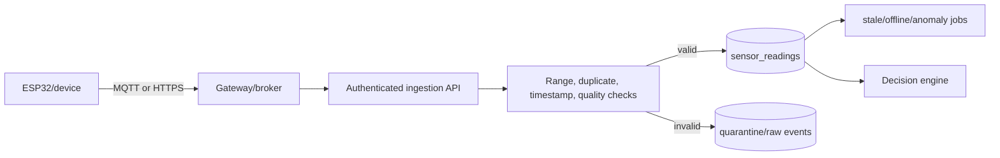

# IoT Architecture

The repository still uses `sensorSim.js` for development. Simulator output must be labeled `SIMULATED` and must never be presented as a physical-device observation.

Production ingestion needs device identity, credential rotation, event IDs, replay protection, calibration metadata, battery/connectivity state, offline buffering, quality flags, quarantine, and sensor health monitoring.