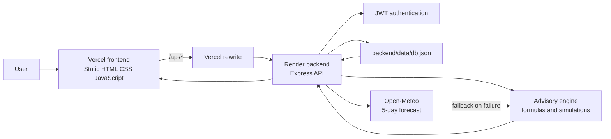

# KhetAI — Irrigation Advisory

KhetAI is a sugarcane irrigation decision-support application. It combines plot information, simulated soil-sensor readings, weather forecasts, and transparent agronomic calculations to produce plot-specific irrigation, fertigation, and yield guidance.

The application is designed for sugarcane farmers and agricultural field teams who need a concise recommendation about when to irrigate, how long to irrigate, how much water is required, and what crop information needs attention.

KhetAI is a working demonstration rather than a production machine-learning platform. Its advisory engine uses deterministic agronomic formulas and simulated sensor data. Weather is fetched from Open-Meteo when available and falls back to a deterministic simulated forecast if the request fails.

## Live Demo

- Frontend: [https://khet-ai-irrigation-advisory.vercel.app](https://khet-ai-irrigation-advisory.vercel.app/)
- Backend API: [https://khet-ai-backend-w1l0.onrender.com](https://khet-ai-backend-w1l0.onrender.com/)
- Health check: [https://khet-ai-backend-w1l0.onrender.com/api/health](https://khet-ai-backend-w1l0.onrender.com/api/health)

## Contents

- [Features](#features)
- [How It Works](#how-it-works)
- [Technology Stack](#technology-stack)
- [Project Structure](#project-structure)
- [API Reference](#api-reference)
- [Authentication](#authentication)
- [Local Development](#local-development)
- [Environment Variables](#environment-variables)
- [Deployment](#deployment)
- [Storage Limitations](#storage-limitations)
- [External Services](#external-services)
- [Application Screens](#application-screens)
- [Security](#security)
- [Future Improvements](#future-improvements)
- [Screenshots](#screenshots)
- [Credits](#credits)

## Features

### Accounts and Authentication

- Farmer registration with name, mobile number, and optional village, taluk, and district.
- Login using mobile number and password.
- Password hashing with `bcryptjs`.
- JWT access-token generation and verification.
- Protected API routes scoped to the authenticated user's plots and data.
- Browser session storage using `localStorage` for the JWT and public user profile.

### Dashboard

- Overview with total managed area, average water stress, estimated current water need, and recent irrigation events.
- Plot selector for switching between managed plots.
- Navigation across overview, plots, advisory, weather, sensors, fertigation, yield, alerts, and profile settings.
- Responsive layout for desktop and smaller screens.
- Local preference storage for advisory language, measurement units, plain-language mode, and notification toggles.

### Plot Management

- List plots owned by the current user.
- Create plots with name, area, crop, variety, planting date, soil type, and optional coordinates.
- Automatic default coordinates near the Northern Karnataka region when coordinates are omitted.
- View individual plot details.
- Update plot records through the backend API.
- Delete plots with cleanup of related sensor readings, irrigation logs, and alerts.
- New plots receive generated history so charts are populated immediately.

### Irrigation Advisory

For each plot, the backend calculates and returns:

- Sugarcane crop stage from crop age.
- Crop age in months.
- Crop coefficient (`Kc`).
- Estimated reference evapotranspiration (`ET0`).
- Crop water requirement (`ETc`).
- Field capacity and current soil moisture.
- Moisture depletion percentage.
- Next irrigation date and days remaining.
- Suggested irrigation duration.
- Net irrigation requirement in millimetres.
- Estimated water volume in cubic metres.
- Water-stress probability and Low/Medium/High level.
- Yield-loss risk percentage.
- Rainfall-adjusted scheduling note.

The farmer-facing advisory sentence is available in English, Hindi, Kannada, and Marathi.

Users can log an irrigation event with duration and water applied. The event is stored and appears in irrigation history and dashboard totals.

### Weather

- Five-day forecast for the selected plot's coordinates.
- Maximum and minimum temperature, humidity, precipitation, rain probability, and condition.
- Open-Meteo data when the external request succeeds.
- Deterministic simulated five-day fallback when Open-Meteo is unavailable.
- Leaflet map showing the plot location with OpenStreetMap tiles.

### Soil and Sensor Information

- Latest 30 cm and 60 cm soil-moisture readings.
- Soil temperature, ambient temperature, ambient humidity, and NDVI values.
- Fourteen-day sensor history.
- Line charts rendered with Chart.js.

Sensor readings are simulated in the repository. They are not received from physical IoT hardware.

### Fertigation

- Stage-specific per-acre recommendations for Urea, DAP, and MOP/Potash.
- Total quantities scaled to the selected plot's area.
- Recommended application date linked to the irrigation advisory.
- Warning when a long irrigation delay may reduce fertigation uptake efficiency.

### Yield Prediction

- Predicted tonnes per hectare.
- Low and high prediction range.
- Confidence note based on recent water-stress exposure.
- Bar chart for low, predicted, and high estimates.
- Stress gauge based on fourteen days of simulated sensor history.

This is a formula-driven estimate, not a trained machine-learning model.

### Alerts

The alerts endpoint generates current alerts for the user's plots based on:

- High soil-moisture stress.
- Significant forecast rainfall.
- Irrigation delay.
- A normal sensor-check status.

Alerts are sorted by severity. Users can mark generated alert IDs as read; read markers are stored in the JSON data file.

## How It Works



### Request Flow

1. A user opens the static frontend hosted by Vercel.
2. The frontend sends requests to paths such as `/api/auth/login` and `/api/advisory/:plotId`.
3. `frontend/vercel.json` rewrites those requests to the deployed Render backend.
4. Express parses the request, verifies the JWT when required, and limits records to the authenticated user.
5. Route handlers read or write `backend/data/db.json` and call the advisory, sensor, or weather utilities.
6. The JSON response is returned through the rewrite and rendered in the browser.

Locally, `backend/server.js` also serves the `frontend` directory, so the complete application can run from one Node.js process.

## Technology Stack

### Frontend

| Technology | Actual use |
|---|---|
| HTML5 | Landing, login, signup, and dashboard pages |
| CSS3 | Shared responsive styling in `frontend/css/style.css` |
| Vanilla JavaScript | API client, authentication state, navigation, rendering, preferences, and interactions |
| Chart.js 4.4.4 | Sensor line charts and yield bar chart via CDN |
| Leaflet 1.9.4 | Plot map and marker via CDN |
| Google Fonts | Fraunces, Inter, and IBM Plex Mono via CDN |

### Backend

| Technology | Actual use |
|---|---|
| Node.js | Runtime |
| Express 4 | HTTP server and API routing |
| `bcryptjs` | Password hashing and comparison |
| `jsonwebtoken` | JWT creation and verification |
| `cors` | Cross-origin response middleware |
| `dotenv` | Loading backend environment variables |

The backend uses Node's built-in `fetch` and `AbortController` for the Open-Meteo request and Node's built-in filesystem and path modules for JSON storage. `nodemon` is available as a development dependency, but there is no frontend build tool.

### Data

The current data layer is a lightweight JSON file database at `backend/data/db.json`. It stores users, plots, sensor readings, irrigation logs, and read-alert markers. The repository includes sample data, and the seed script can add demo data where appropriate.

### Deployment

- GitHub stores the source repository.
- Vercel hosts the static frontend from `frontend`.
- Render hosts the Node.js backend from `backend`.
- Vercel rewrites frontend `/api/:path*` requests to the Render backend.

## Project Structure

```text
KhetAI---Irrigation-Advisory/
├── README.md
├── frontend/
│   ├── index.html
│   ├── login.html
│   ├── signup.html
│   ├── dashboard.html
│   ├── vercel.json
│   ├── css/
│   │   └── style.css
│   └── js/
│       ├── api.js
│       ├── config.js
│       ├── dashboard.js
│       └── gauge.js
└── backend/
    ├── .env.example
    ├── .gitignore
    ├── data/
    │   └── db.json
    ├── db.js
    ├── package.json
    ├── package-lock.json
    ├── server.js
    ├── middleware/
    │   └── auth.js
    ├── routes/
    │   ├── advisory.routes.js
    │   ├── alerts.routes.js
    │   ├── auth.routes.js
    │   ├── dashboard.routes.js
    │   ├── fertigation.routes.js
    │   ├── plots.routes.js
    │   ├── sensors.routes.js
    │   ├── weather.routes.js
    │   └── yield.routes.js
    └── utils/
        ├── aiEngine.js
        ├── idgen.js
        ├── multilingual.js
        ├── seed.js
        ├── sensorSim.js
        └── weather.js
```

### Important Files

- `frontend/index.html`: public landing page and static entry point.
- `frontend/login.html`: login form and session creation flow.
- `frontend/signup.html`: farmer registration form.
- `frontend/dashboard.html`: authenticated application shell and dashboard views.
- `frontend/js/api.js`: same-origin API client and authentication helpers.
- `frontend/js/config.js`: defines `API_BASE` as `/api`.
- `frontend/js/dashboard.js`: dashboard state, API calls, view rendering, charts, language handling, and settings controls.
- `frontend/vercel.json`: proxies `/api/:path*` to Render.
- `backend/server.js`: Express app, API registration, static frontend serving for local use, and health endpoint.
- `backend/db.js`: JSON-file database read/write helpers.
- `backend/utils/aiEngine.js`: transparent irrigation, fertigation, and yield formulas.
- `backend/utils/sensorSim.js`: generated sensor readings and history.
- `backend/utils/weather.js`: Open-Meteo integration and deterministic fallback forecast.
- `backend/utils/multilingual.js`: four advisory-message languages.

## API Reference

The API is mounted under `/api`. Every route below except the public authentication operations and health check requires a Bearer JWT.

### Health

| Method | Endpoint | Auth | Purpose |
|---|---|---:|---|
| GET | `/api/health` | No | Returns `{ "status": "ok", "time": "..." }`. |

### Authentication APIs

| Method | Endpoint | Auth | Request | Response purpose |
|---|---|---:|---|---|
| POST | `/api/auth/register` | No | JSON: `name`, `mobile`, `password`; optional `village`, `taluk`, `district` | Creates a user, hashes the password, and returns a JWT plus public user data. Passwords must be at least six characters. |
| POST | `/api/auth/login` | No | JSON: `mobile`, `password` | Verifies credentials and returns a JWT plus public user data. |
| GET | `/api/auth/me` | Yes | Bearer token | Returns the authenticated user's public profile. |

### Plot APIs

| Method | Endpoint | Auth | Request / parameters | Response purpose |
|---|---|---:|---|---|
| GET | `/api/plots` | Yes | None | Lists plots owned by the authenticated user. |
| POST | `/api/plots` | Yes | JSON: required `name`, `area`, `plantingDate`, `soilType`; optional `crop`, `variety`, `lat`, `lng` | Creates a plot and generates initial sensor and irrigation history. |
| GET | `/api/plots/:id` | Yes | Path plot ID | Returns one owned plot. |
| PUT | `/api/plots/:id` | Yes | JSON patch; `id` and `userId` are ignored | Updates an owned plot. |
| DELETE | `/api/plots/:id` | Yes | Path plot ID | Deletes the plot and related sensor, irrigation, and alert records. |

### Dashboard API

| Method | Endpoint | Auth | Request / parameters | Response purpose |
|---|---|---:|---|---|
| GET | `/api/dashboard/summary` | Yes | None | Returns plot count, total area, average stress, estimated water need, recent irrigation totals, and per-plot status. |

### Advisory APIs

| Method | Endpoint | Auth | Request / parameters | Response purpose |
|---|---|---:|---|---|
| GET | `/api/advisory/languages` | Yes | None | Returns English, Hindi, Kannada, and Marathi. |
| GET | `/api/advisory/:plotId` | Yes | Optional query `lang=en\|hi\|kn\|mr` | Returns the calculated advisory, forecast, latest reading, farmer-facing message, and selected language. |
| POST | `/api/advisory/:plotId/log` | Yes | JSON: `durationHours`, `waterAppliedM3` | Stores a manual irrigation event. |
| GET | `/api/advisory/:plotId/history` | Yes | Path plot ID | Returns irrigation logs for the owned plot, newest first. |

### Weather APIs

| Method | Endpoint | Auth | Request / parameters | Response purpose |
|---|---|---:|---|---|
| GET | `/api/weather/:plotId` | Yes | Path plot ID | Returns a five-day Open-Meteo forecast or simulated fallback for the plot coordinates. |

### Sensor APIs

| Method | Endpoint | Auth | Request / parameters | Response purpose |
|---|---|---:|---|---|
| GET | `/api/sensors/:plotId` | Yes | Path plot ID | Returns the latest simulated reading and fourteen days of history. |

### Fertigation APIs

| Method | Endpoint | Auth | Request / parameters | Response purpose |
|---|---|---:|---|---|
| GET | `/api/fertigation/:plotId` | Yes | Path plot ID | Returns stage-specific per-acre and plot-scaled Urea, DAP, and MOP recommendations. |

### Yield APIs

| Method | Endpoint | Auth | Request / parameters | Response purpose |
|---|---|---:|---|---|
| GET | `/api/yield/:plotId` | Yes | Path plot ID | Returns predicted yield, low/high range, confidence note, and historical stress average. |

### Alert APIs

| Method | Endpoint | Auth | Request / parameters | Response purpose |
|---|---|---:|---|---|
| GET | `/api/alerts` | Yes | None | Generates and returns current alerts for all plots owned by the authenticated user. |
| POST | `/api/alerts/:alertId/read` | Yes | Path alert ID | Stores the alert as read for the current user. |

## Authentication

1. Registration validates required fields and password length.
2. The password is hashed with `bcryptjs` using a work factor of 10 before storage.
3. Login compares the submitted password with the stored hash.
4. Successful registration and login sign a JWT containing the user ID, name, and mobile number.
5. The token lifetime is controlled by `JWT_EXPIRES_IN`, defaulting to `7d` in the route logic.
6. Protected routes read the `Authorization: Bearer <token>` header and verify the token with `JWT_SECRET`.
7. The browser stores the token in `localStorage`. A 401 response clears the local session and redirects to `login.html`.

Passwords are never returned by the API; the stored `passwordHash` is removed from public user responses.

## Local Development

### Prerequisites

- Node.js 18 or newer.
- npm.
- Internet access is optional for weather because the backend has a simulated fallback, but it is required for live Open-Meteo data and CDN assets.

### Clone

```bash
git clone <repository-url>
cd <repository-folder>
```

### Backend Setup

```bash
cd backend
npm install
```

Create `backend/.env` from the example:

```dotenv
PORT=5000
JWT_SECRET=your_secret_here
JWT_EXPIRES_IN=7d
```

Start the server:

```bash
npm start
```

The server listens on `http://localhost:5000` and serves the frontend as well as the API. Open:

```text
http://localhost:5000
```

The optional seed command loads demo data into the JSON database:

```bash
npm run seed
```

The development script uses `nodemon`:

```bash
npm run dev
```

No separate frontend installation or build command is required when using the Express server locally.

## Environment Variables

The backend reads these variables through `dotenv`:

| Variable | Purpose | Example |
|---|---|---|
| `PORT` | Port used by Express. | `5000` |
| `JWT_SECRET` | Secret used to sign and verify JWTs. | `your_production_secret` |
| `JWT_EXPIRES_IN` | JWT lifetime passed to `jsonwebtoken`. | `7d` |

The local `.env` file must not be committed. It is ignored by `backend/.gitignore`. Configure production values as protected environment variables in Render. Never place `JWT_SECRET` in frontend code or expose it in browser configuration.

## Deployment

### Frontend on Vercel

- Root directory: `frontend`
- Framework preset: static/no framework
- Build command: none
- Output directory: the `frontend` directory itself
- Entry page: `frontend/index.html`

`frontend/vercel.json` contains the routing configuration:

```json
{
  "rewrites": [
    {
      "source": "/api/:path*",
      "destination": "https://khet-ai-backend-w1l0.onrender.com/api/:path*"
    }
  ]
}
```

Because `frontend/js/config.js` uses `const API_BASE = "/api"`, existing frontend API calls continue to work through the Vercel rewrite.

### Backend on Render

- Root directory: `backend`
- Build command: `npm install`
- Start command: `node server.js`
- Required environment variables: `PORT`, `JWT_SECRET`, and `JWT_EXPIRES_IN`

The Render service must allow requests from the Vercel frontend. The backend currently enables CORS with the default `cors()` middleware.

### GitHub Workflow

The repository is hosted on GitHub. Source changes can be pushed to the configured repository and connected to Vercel and Render for deployments. Deployment providers should be configured with the project root directories above.

## Storage Limitations

The application does not use MongoDB, PostgreSQL, SQLite, or another external database. It uses `backend/data/db.json` through synchronous filesystem reads and writes in `backend/db.js`.

This is convenient for a self-contained college or demonstration project, but it has important cloud limitations:

- Filesystem writes on many serverless or ephemeral hosts are not durable between instances or redeployments.
- Concurrent writes can overwrite one another because there is no transaction or database locking layer.
- The complete dataset is loaded and rewritten for individual operations.
- There is no backup, migration, indexing, replication, or multi-instance consistency.

For production use, replace the `db.js` implementation with a managed persistent database such as PostgreSQL or MongoDB while preserving the route-level data contracts. Add migrations, backups, access controls, and observability before scaling beyond a demonstration deployment.

## External Services

| Service | Used for | Location | API key |
|---|---|---|---|
| Open-Meteo | Five-day weather forecast by plot latitude and longitude | `backend/utils/weather.js` | Not required |
| OpenStreetMap tiles | Map tiles for the plot-location map | `frontend/dashboard.html` through Leaflet | Not required for this demo; follow tile-use policies for production |
| Leaflet CDN | Map library | `frontend/dashboard.html` | Not required |
| Chart.js CDN | Charts | `frontend/dashboard.html` | Not required |
| Google Fonts | Fraunces, Inter, and IBM Plex Mono fonts | HTML page headers | Not required |

Open-Meteo requests have a four-second abort timeout. If the request fails or returns a non-success status, `weather.js` returns a deterministic simulated forecast instead. The sensor, yield-history, and advisory data are generated locally by the backend and do not come from an external sensor platform or satellite API.

## Application Screens

| Page | Purpose |
|---|---|
| `index.html` | Public landing page describing KhetAI and linking to account creation and login. |
| `login.html` | Authenticates an existing farmer through the backend login API. |
| `signup.html` | Creates a farmer account and redirects to the dashboard. |
| `dashboard.html` | Authenticated application containing overview, plot management, advisory, weather, sensor, fertigation, yield, alert, and profile/settings views. |

The dashboard uses client-side view switching within one HTML document. Navigation and data requests are handled by `frontend/js/dashboard.js` and `frontend/js/api.js`.

## Security

Implemented protections include:

- Password hashing with `bcryptjs`; plaintext passwords are not stored.
- JWT-based authentication for protected routes.
- User ownership checks on plot-scoped resources.
- Removal of password hashes from public user responses.
- Environment-based JWT secret configuration.
- CORS middleware on the backend.
- `.env` excluded through `backend/.gitignore`.

Important limitations:

- JWTs are stored in browser `localStorage`, which is exposed to JavaScript running in the page; an HttpOnly cookie strategy would provide stronger session protection.
- The included JSON database has no encryption, transactions, or access-control layer of its own.
- There is no rate limiting, account lockout, email/phone verification, password reset flow, refresh-token rotation, or audit logging.
- The default CORS configuration is broad and should be restricted to known production origins.
- Production deployments must use a strong, private `JWT_SECRET` rather than a development value.

## Future Improvements

The following are future improvements, not current capabilities:

- Move persistent data to a managed relational or document database.
- Connect real soil-moisture, weather-station, and IoT sensor ingestion pipelines.
- Replace simulated advisory formulas with validated, monitored agronomic or machine-learning models.
- Add server-side validation schemas, rate limiting, secure cookies, refresh tokens, password reset, and verified contact details.
- Restrict CORS and add structured logging, health monitoring, backups, and error tracking.
- Add automated tests for route authorization, advisory calculations, and frontend workflows.
- Add real notification delivery through a configured SMS, email, or push provider.
- Add richer historical analytics and role-specific views for agronomists and field supervisors.
- Provide a dedicated mobile application or installable progressive web application.

## Screenshots

Screenshots can be added to this section when image files are committed to the repository.

### Landing Page

<!-- Add screenshot here -->

### Dashboard Overview

<!-- Add screenshot here -->

### Irrigation Advisory

<!-- Add screenshot here -->

### Login

<!-- Add screenshot here -->

## Credits

KhetAI is an educational and portfolio-ready implementation of an irrigation advisory workflow for sugarcane cultivation. The repository demonstrates a complete browser-to-API flow, transparent calculation utilities, multilingual farmer messaging, and a deployable split between a Vercel frontend and Render backend.
