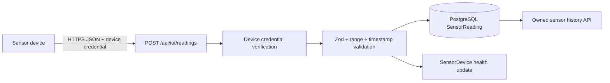

# IoT Sensor Ingestion

## Status

KhetAI now has a production-oriented ingestion foundation, but no physical hardware or MQTT gateway has been connected or tested. The current simulator remains available for development and is stored as `SIMULATED` data. Device API submissions are stored as `LIVE` data only after device authentication and validation.

## Architecture



## Authentication

A farmer JWT is not accepted for ingestion. A farmer who owns a device can provision a credential through:

```text
POST /api/iot/devices/:deviceId/credential
Authorization: Bearer <farmer-token>
```

The response contains an opaque credential once. The server stores only a bcrypt hash. A device submits:

```text
X-Device-Key: <device key>
X-Device-Secret: <opaque credential>
```

Secrets are never logged or returned again. Credential revocation is represented by `credentialRevokedAt`; inactive devices are rejected.

## Ingestion endpoint

```text
POST /api/iot/readings
X-Device-Key: demo-device-key
X-Device-Secret: fake-development-secret
Content-Type: application/json
```

Example with fake data and credentials:

```json
{
  "eventId": "fake-device-event-001",
  "measuredAt": "2026-09-21T08:30:00Z",
  "measurements": [
    { "type": "soil_moisture_30", "value": 24.5, "unit": "percent" },
    { "type": "soil_temperature", "value": 27.2, "unit": "C" }
  ],
  "batteryPct": 82,
  "firmware": "demo-1.0"
}
```

A device does not submit a plot ID. The server uses the active device's registered plot association, preventing arbitrary plot writes.

## Validation and quality

Supported measurements and ranges:

| Type | Unit | Range |
|---|---|---:|
| `soil_moisture_30`, `soil_moisture_60` | `percent` | 0-100 |
| `soil_temperature` | `C` | -20 to 80 |
| `ambient_temperature` | `C` | -40 to 80 |
| `humidity` | `percent` | 0-100 |
| `rainfall` | `mm` | 0-500 |
| `ndvi` | `unitless` | -1 to 1 |

Malformed payloads, unsupported units, impossible values, and timestamps more than five minutes in the future are rejected. Measurements older than 30 days are retained as `SUSPECT` with a reason rather than silently deleted. Accepted device rows are `LIVE`; simulator/import rows retain their original provenance.

Each row stores both the device measurement timestamp (`measuredAt`) and server receipt timestamp (`ingestedAt`), plus `sourceEventId`, normalized `sensorType`, `unit`, `value`, quality, and the raw non-secret payload.

## Duplicate behavior

Each measurement is keyed by `deviceId + eventId + measurement type` through the deterministic `sourceEventId`. Repeating the same payload returns `202` with an incremented `duplicates` count and does not create another row. Reusing an event ID with different measurement data returns `409`.

## Device health

Authorized farmer users can inspect their device health:

```text
GET /api/iot/devices/health
GET /api/iot/devices/health?plotId=<owned-plot-id>
```

Health uses actual stored state: active flag, connected flag, `lastSeenAt`, `lastIngestedAt`, battery when supplied, firmware, and health status. Battery values are never invented. The ingestion path marks a successful device as `ONLINE`; no background stale/offline job is claimed yet.

## Simulator

`backend/utils/sensorSim.js` remains the development simulator. It writes through the PostgreSQL repository, uses deterministic event keys for backfill/today readings, and marks rows `SIMULATED`. It does not use device credentials and cannot create `LIVE` rows.

## Security and operations

- Global request body limits and device-specific rate limiting apply.
- Device lookup verifies active status, credential hash, revoked status, and plot association.
- Farmer health queries enforce farm ownership.
- Request logs include request ID, route, status, and duration but not headers, tokens, secrets, or payloads.
- Real deployments should use HTTPS, credential rotation, device provisioning controls, replay-resistant signatures or mTLS, gateway buffering, anomaly quarantine, and a dedicated broker/ingestion worker.

No physical device protocol, MQTT broker, gateway, or hardware integration is implemented in this phase.
