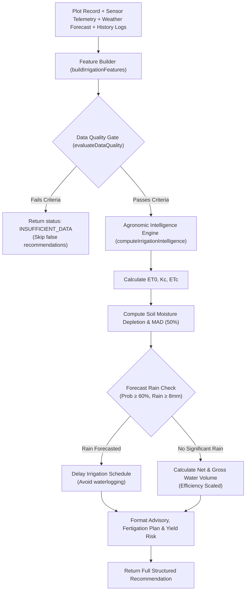

# KhetAI — Irrigation Intelligence Engine Architecture & Specification

This document describes the design, agronomic baseline formulas, feature-builder layer, data-quality gate policies, irrigation efficiency calculations, and decision pipeline for the KhetAI Irrigation Intelligence Engine.

---

## 1. Advisory Engine Audit & Formulas

The KhetAI Irrigation Intelligence Engine computes actionable sugarcane irrigation advisories derived from real physical inputs and FAO-56 agronomic standards.

### Agronomic Formulas & Constants

#### Crop Growth Stage & Crop Coefficient ($K_c$)
Sugarcane development is divided into four FAO-56 growth stages based on crop age in months ($t_{\text{months}} = \frac{\text{now} - \text{plantingDate}}{30.44}$):

| Crop Age Range ($t_{\text{months}}$) | Growth Stage Name | Crop Coefficient ($K_c$) | Agronomic Description |
| :--- | :--- | :--- | :--- |
| $0 \le t \le 2$ | Germination & Establishment | $0.40$ | Low transpiration demand; early root setup |
| $2 < t \le 4$ | Tillering | $0.75$ | Rapid shoot growth and canopy development |
| $4 < t \le 9$ | Grand Growth | $1.25$ | Peak biomass expansion and highest water demand |
| $t > 9$ | Maturity & Ripening | $0.80$ | Reduced water demand; sucrose accumulation |

#### Soil Hydro-Physical Profiles

| Soil Type | Field Capacity ($FC, \%$) | Permanent Wilting Point ($WP, \%$) | Infiltration Rate ($I_{\text{rate}}, \text{mm/h}$) |
| :--- | :--- | :--- | :--- |
| `Sandy` | 18% | 6% | 14 mm/h |
| `Sandy Loam` | 22% | 9% | 11 mm/h |
| `Loam` | 28% | 12% | 8 mm/h |
| `Clay Loam` | 34% | 16% | 5 mm/h |
| `Clay` | 40% | 20% | 3 mm/h |

#### Crop Water Requirement ($ET_c$)
$$ET_c (\text{mm/day}) = ET_0 \times K_c$$
Where $ET_0$ is the reference evapotranspiration (fetched directly from Open-Meteo or calculated via Hargreaves formula).

#### Soil Moisture Depletion & Management Allowed Depletion (MAD)
Available Soil Water Capacity: $AWC = FC - WP$
Soil Moisture Depletion Ratio:
$$D_{\text{pct}} = \max\left(0, \min\left(1, \frac{FC - \theta_{\text{current}}}{FC - WP}\right)\right)$$
Sugarcane tolerates a Management Allowed Depletion ($MAD$) threshold of $50\%$ ($0.50$).

Buffer Days Left:
$$T_{\text{buffer}} = \max\left(0, \frac{(MAD - D_{\text{pct}}) \times AWC}{\max(ET_c, 0.5)}\right)$$

#### Net & Gross Water Requirement ($m^3$)
- **Net Requirement (mm)**: $\text{Req}_{\text{net}} = (FC - \theta_{\text{current}}) \times 0.9$
- **Irrigation Duration (hours)**: $T_{\text{duration}} = \max\left(0.5, \frac{\text{Req}_{\text{net}}}{I_{\text{rate}}}\right)$
- **Gross Requirement (mm)**: $\text{Req}_{\text{gross}} = \frac{\text{Req}_{\text{net}}}{\eta_{\text{efficiency}}}$
- **Gross Volume ($m^3$)**:
  $$V_{\text{water}} (m^3) = \frac{\text{Req}_{\text{gross}}}{1000} \times \text{Area (acres)} \times 4046.86\frac{m^2}{\text{acre}}$$

#### Application Efficiency ($\eta_{\text{efficiency}}$)

| Irrigation Method | Application Efficiency ($\eta_{\text{efficiency}}$) |
| :--- | :--- |
| `Drip` | 0.90 (90%) |
| `MicroSprinkler` | 0.85 (85%) |
| `Sprinkler` | 0.75 (75%) |
| `Furrow` / `Surface` / `Default` | 0.60 (60%) |
| `Flood` | 0.55 (55%) |

---

## 2. Decision Pipeline Architecture



---

## 3. Data Quality Gate Rules

Before computing an advisory recommendation, `evaluateDataQuality(features)` enforces strict validation rules:

1. **Rejection Criteria (`status: "INSUFFICIENT_DATA"`)**:
   - Missing plot `plantingDate` or `soilType`.
   - Missing or `null` soil moisture telemetry.
   - Latest sensor reading has `quality: "INVALID"`.
   - Sensor telemetry is stale (older than 168 hours / 7 days).
   - Missing weather forecast data.

2. **Warning Criteria (`status: "OK"` with `warnings[]`)**:
   - Sensor reading has `quality: "SUSPECT"` (older than 30 days or minor drift). Adds warning advising manual soil check.
   - Weather forecast has `provenance: "FALLBACK"` (simulated fallback used).

---

## 4. Feature Builder Specification

The feature builder module ([`irrigationFeatures.js`](file:///c:/Users/sudha/Downloads/New%20folder%20%282%29/KhetAI-Irrigation-Advisory/backend/utils/irrigationFeatures.js)) consolidates heterogeneous raw data into a clean feature payload:

```json
{
  "plotId": "plot_clx101",
  "cropFeatures": {
    "cropType": "Sugarcane",
    "plantingDate": "2026-01-01",
    "cropAgeMonths": 8.7,
    "growthStage": "Grand Growth (peak water demand)",
    "kc": 1.25
  },
  "soilFeatures": {
    "soilType": "Loam",
    "fieldCapacity": 28,
    "wiltingPoint": 12,
    "availableWaterCapacity": 16,
    "infiltrationRate": 8
  },
  "plotFeatures": {
    "areaAcres": 2.5,
    "lat": 16.5,
    "lng": 75.1,
    "irrigationMethod": "Drip",
    "efficiency": 0.90
  },
  "sensorFeatures": {
    "soilMoisture30": 20.0,
    "soilMoisture60": 22.0,
    "quality": "VALID",
    "freshnessHours": 2.1,
    "provenance": "SIMULATED"
  },
  "weatherFeatures": {
    "et0": 5.2,
    "tempMax": 33.0,
    "tempMin": 22.0,
    "humidity": 60,
    "rainMm": 0.0,
    "rainProbability": 10,
    "provenance": "LIVE_API"
  },
  "historyFeatures": {
    "lastIrrigationDate": "2026-09-15",
    "recentCount30Days": 3
  },
  "provenanceSummary": {
    "sensor": "SIMULATED",
    "weather": "LIVE_API",
    "soilProfile": "FAO56_STANDARD"
  }
}
```

---

## 5. Machine Learning Readiness & Plug-in Architecture

The `computeIrrigationIntelligence` interface accepts standard feature dictionaries. When real agricultural sensor/yield datasets are acquired in future phases, trained machine learning models (e.g. XGBoost, Random Forest, or Neural Networks) can be inserted directly behind `computeIrrigationIntelligence` without altering frontend components or API route contracts.

---

## 6. Phase 6C — Frontend Irrigation Intelligence Display

### 6.1 What the frontend shows

The Irrigation Advisory view in KhetAI renders the backend decision as a structured visual display:

| UI Element | What it shows | Source |
|---|---|---|
| **Decision Badge** | `IRRIGATE_NOW` / `IRRIGATE_SOON` / `MONITOR` / `NO_IRRIGATION` / `INSUFFICIENT_DATA` | Backend engine |
| **Trust & Provenance Bar** | Sensor type · Weather source · Decision engine type | API `trustIndicators` |
| **"Why This Recommendation?"** | Plain-language explanation bullets | API `explanationBullets` |
| **Warning Banner** | Stale sensor / low data quality alerts | API `technicalDetails.dataQualityStatus` |
| **Collapsible Technical Panel** | Model type, feature version, provenance, quality flag, timestamp | API `technicalDetails` |
| **Scenario Demo Control** | 4 simulated field scenarios routed through real backend logic | POST `/api/demo/scenario` |

### 6.2 API Contract (GET /api/advisory/:plotId)

```json
{
  "status": "OK",
  "decisionBadge": {
    "code": "IRRIGATE_NOW",
    "label": "Irrigate Now"
  },
  "farmerMessage": "Your sugarcane needs water today…",
  "advisory": { /* FAO-56 numeric fields */ },
  "trustIndicators": {
    "sensorProvenance": "SIMULATED",
    "sensorLabel": "Simulated demo data",
    "weatherProvenance": "LIVE_API",
    "weatherLabel": "Live weather forecast",
    "engineLabel": "Agronomic calculation",
    "engineDetail": "FAO-56 Penman-Monteith crop water balance"
  },
  "technicalDetails": {
    "modelType": "AGRONOMIC_BASELINE",
    "featureVersion": "v1.0-fao56",
    "weatherProvenance": "LIVE_API",
    "sensorProvenance": "SIMULATED",
    "dataQualityStatus": "VALID",
    "calculatedAt": "2026-09-21T07:10:00Z"
  },
  "explanationBullets": [
    "Soil moisture is currently at 14.0% relative to a field capacity of 28%.",
    "…"
  ]
}
```

### 6.3 Scenario Demo Control (POST /api/demo/scenario)

The Simulated Scenario Demo Control lets users test the advisory logic interactively. Each scenario writes controlled `SIMULATED`-provenance telemetry to PostgreSQL, then the advisory endpoint re-evaluates the full decision pipeline.

| Scenario ID | Condition | Expected Badge |
|---|---|---|
| `SCENARIO_1_NORMAL` | 26% moisture | `MONITOR` |
| `SCENARIO_2_LOW_MOISTURE` | 14% moisture | `IRRIGATE_NOW` |
| `SCENARIO_3_RAIN_EXPECTED` | 22% moisture + 25mm forecast rain | `MONITOR` |
| `SCENARIO_4_STALE_SENSOR` | INVALID quality (stale telemetry) | `INSUFFICIENT_DATA` |

### 6.4 Important Honesty Disclaimers

> **No machine learning model exists in this version.**
> The `AGRONOMIC_BASELINE` decision engine uses deterministic FAO-56 crop water balance formulas. All sensor data is simulated (labeled `SIMULATED`) and marked so in every API response. No physical sensor hardware is connected.

> **"Agronomic calculation" is the correct label.**
> The frontend deliberately uses the label "Agronomic calculation" and NOT "AI" or "Machine Learning" for the decision engine, in keeping with Phase 6C honesty constraints.

---
